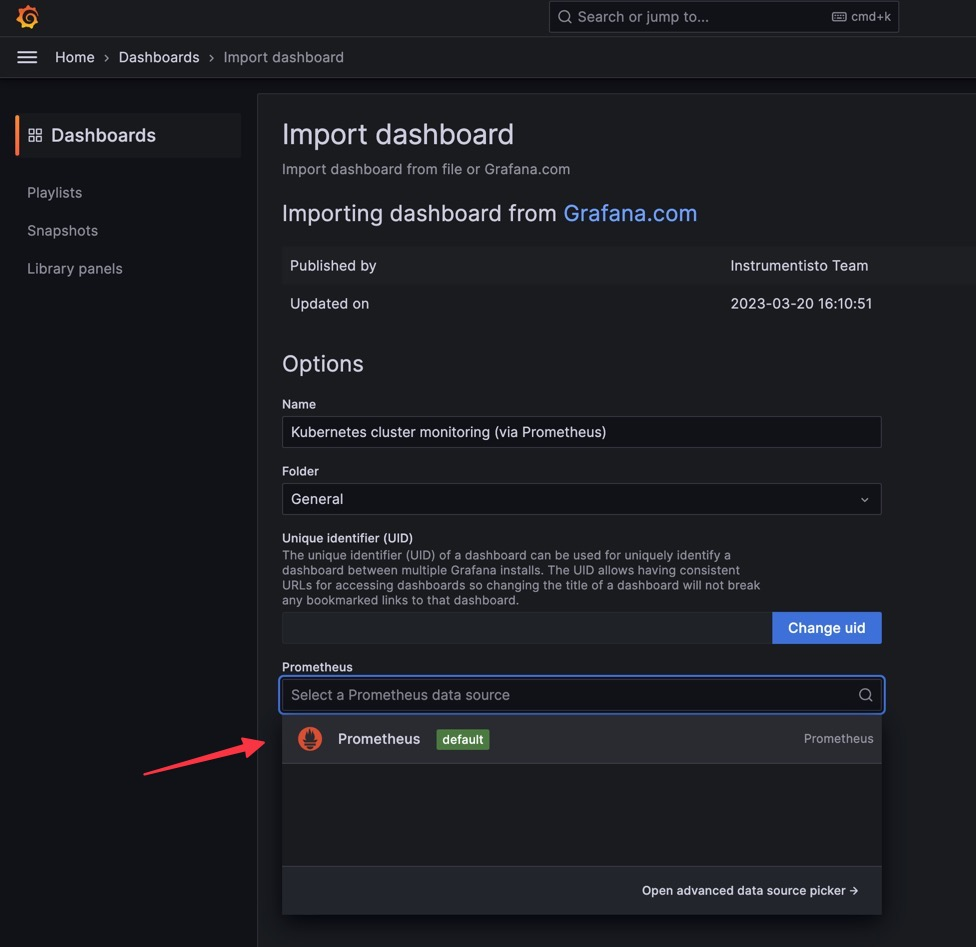

# Installing Prometheus and Grafana on one machine using K3s 

Follow the instuctions to install Prometheus and Grafana on a single-node K3s machine using local mounts for data persistence.

## Prerequisites

- Docker
- Helm
- k3d
- kubectx and kubens

## Preparing the cluster

Define directories for data persistence, for example:

```bash
export PROMETHEUS_DATA=$HOME/prometheus-data
export GRAFANA_DATA=$HOME/grafana-data
```

Create the directories.

```bash
# adjust as needed
mkdir -p $PROMETHEUS_DATA $GRAFANA_DATA
```

Create the cluster. You must pass the volume mount mapping during cluster initialization, as [it is not possible to add mounts on an existing cluster](https://github.com/k3d-io/k3d/issues/566). The following command creates the cluster and maps the mounts for data persistence for the master node. The worker nodes do not mount any directories.

```bash
# this creates a cluster with 1 master node and 2 worker nodes
k3d cluster create \
    --volume $PROMETHEUS_DATA:/prometheus-data@server:0 \
    --volume $GRAFANA_DATA:/grafana-data@server:0 \
    --servers 1 --agents 2
```

Create a monitoring namespace to run both applications. You can use *kubens* to switch the current namespace once created.

```bash
kubectl create namespace monitoring
kubens monitoring
```

Add a label to the master node. We'll use this to run the applications only on this node. Adjust the name of the master node as needed. Use `kubectl get nodes` to see all the existing nodes in your cluster. The default master node for the default cluster is called "k3d-k3s-default-server-0".

```bash
kubectl label nodes k3d-k3s-default-server-0 run=monitoring
```

## Installing Prometheus

Create a PersistentVolume and a PersistentVolumeClaim for storing Prometheus data.

```bash
kubectl apply -f prometheus-pv.yaml 
kubectl apply -f prometheus-pvc.yaml
```

Add the Prometheus repository and update Helm.

```bash
helm repo add prometheus-community https://prometheus-community.github.io/helm-charts
helm repo update
```

Install Prometheus. Adjust the name of the instance as needed. In the following example the instance name is "my-prometheus". The command installs Prometheus with data persistence and forces it to run on the master node.

```bash
helm install my-prometheus prometheus-community/prometheus \
  --namespace monitoring \
  --set server.persistentVolume.enabled=true \
  --set server.persistentVolume.storageClass=local-storage \
  --set server.persistentVolume.existingClaim=prometheus-pvc \
  --set "server.affinity.nodeAffinity.requiredDuringSchedulingIgnoredDuringExecution.nodeSelectorTerms[0].matchExpressions[0].key=run" \
  --set "server.affinity.nodeAffinity.requiredDuringSchedulingIgnoredDuringExecution.nodeSelectorTerms[0].matchExpressions[0].operator=In" \
  --set "server.affinity.nodeAffinity.requiredDuringSchedulingIgnoredDuringExecution.nodeSelectorTerms[0].matchExpressions[0].values[0]=monitoring"
```

In the output of the Helm install command you will find the URL for the Prometheus server. Take note of it as you'll need it later, for example:

```bash
The Prometheus server can be accessed via port 80 on the following DNS name from within your cluster:
my-prometheus-server.monitoring.svc.cluster.local
```

You can see the full installation instructions and configurable values in the [Prometheus Helm Chart](https://artifacthub.io/packages/helm/prometheus-community/prometheus).

Wait until all services, pods and deployments are fully running. You can use *k9s* to monitor the cluster in real time (and look cool in the process :)

The directory `$PROMETHEUS_DATA` on the host should have new files by now.

## Installing Grafana

Create a PersistentVolume and a PersistentVolumeClaim for storing Grafana data.

```bash
kubectl apply -f grafana-pv.yaml 
kubectl apply -f grafana-pvc.yaml
```

Add the Grafana repository and update Helm.

```bash
helm repo add grafana https://grafana.github.io/helm-charts
helm repo update
```

Install Grafana. Adjust the name of the instance as needed. In the following example the instance name is "my-grafana". The command installs Grafana with data persistence and forces it to run on the master node.

```bash
helm install my-grafana grafana/grafana \
 --namespace monitoring \
 --set persistence.enabled=true \
 --set persistence.storageClassName="local-storage" \
 --set persistence.existingClaim="grafana-pvc" \
 --set "affinity.nodeAffinity.requiredDuringSchedulingIgnoredDuringExecution.nodeSelectorTerms[0].matchExpressions[0].key=run" \
 --set "affinity.nodeAffinity.requiredDuringSchedulingIgnoredDuringExecution.nodeSelectorTerms[0].matchExpressions[0].operator=In" \
 --set "affinity.nodeAffinity.requiredDuringSchedulingIgnoredDuringExecution.nodeSelectorTerms[0].matchExpressions[0].values[0]=monitoring"
```

You can see the full installation instructions and configurable values in the [Grafana Helm Chart](https://artifacthub.io/packages/helm/grafana/grafana).

Wait until all services, pods and deployments are fully running.

The directory `$GRAFANA_DATA` should be populated by now.

## Exposing Grafana Dashboard

The last Helm install command should print out the command required to export the Grafana dashboard. Run them on a separate terminal and keep it open. For example:

```bash
POD_NAME=$(kubectl get pods --namespace monitoring -l "app.kubernetes.io/name=grafana,app.kubernetes.io/instance=my-grafana" -o jsonpath="{.items[0].metadata.name}")
kubectl --namespace monitoring port-forward $POD_NAME 3000
```

## Configuring data source for Grafana

Open a second terminal and run this command to retrieve the randomly-generated admin password:

```bash
kubectl get secret --namespace monitoring my-grafana -o jsonpath="{.data.admin-password}" | base64 --decode ; echo
```

Open a browser to localhost:3000 and login with the user "admin" and the retrieved password.

To add Prometheus as a data source:
1. Click "Home" > "Data Sources" > "Add your first data source". 
2. Select Prometheus.
3. In the "Prometheus server URL" field paste the URL of the Prometheus server prefixed with "http://". For example:

```bash
http://my-prometheus-server.monitoring.svc.cluster.local
```

Click "Save and test". You should get a success message.

---


## Adding a premade dashboard in Grafana

You can create your own dashboard or load a predefined one from the [Grafana Dashboard Library](https://grafana.com/grafana/dashboards/).

To load a pre-defined dashboard:

1. Click on the top-left menu and select Dashboards.
2. Click the New button and select Import. 
3. In the "Import via grafana.com" field type the ID of the dashboard you want (for example, "315").
4. Click on Load.
5. Near the bottom, under the Prometheus field, select the Prometheus data source (the only one present).
6. Click Import.

The new dashboard should begin showing data.

---





## Checking that persistency is working

You can check that persistency is working by listing the contents of `$PROMETHEUS_DATA` and `$GRAFANA_DATA` in the host machine. The directories should not be empty and have files timestamped to the current time.

Alternatively, you can restart the cluster or terminate the Grafana or Prometheus nodes. The data should still be there after pods have respawned.


